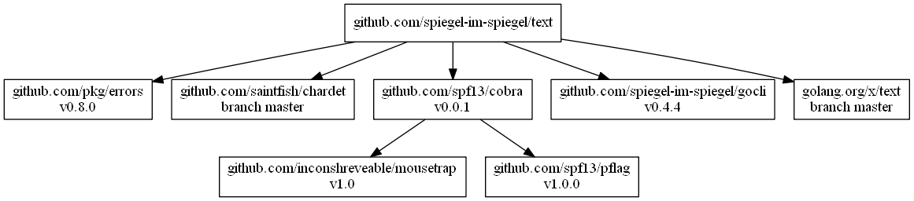

# [text] - Encoding/Decoding Text Package by [Golang]

[](https://travis-ci.org/spiegel-im-spiegel/text)

## Install

```
$ go get github.com/spiegel-im-spiegel/text
```

Installing by [dep].

```
$ dep ensure -add github.com/spiegel-im-spiegel/text
```

## Usage

### detect

```go
encoding := detect.EncodingJa(bytes.NewBufferString("こんにちは，世界"))
fmt.Println(encoding)
// Output:
// UTF-8
```

### decode

```go
jisText := []byte{0x1b, 0x24, 0x42, 0x24, 0x33, 0x24, 0x73, 0x24, 0x4b, 0x24, 0x41, 0x24, 0x4f, 0x40, 0x24, 0x33, 0x26, 0x1b, 0x28, 0x42}
res, err := decode.ToUTF8ja(bytes.NewReader(jisText))
if err != nil {
    fmt.Println(err)
    return
}
buf := new(bytes.Buffer)
io.Copy(buf, res)
fmt.Println(buf)
// Output:
// こんにちは世界
```

### encode

```go
utf8Text := "こんにちは，世界\n"
res, err := encode.FromUTF8To(detect.ISO2022JP, bytes.NewBufferString(utf8Text))
if err != nil {
    fmt.Println(err)
    return
}
buf := new(bytes.Buffer)
io.Copy(buf, res)
fmt.Println(buf.Bytes())
// Output:
// [27 36 66 36 51 36 115 36 75 36 65 36 79 33 36 64 36 51 38 27 40 66 10]
```

### convert

```go
jisText := []byte{0x1b, 0x24, 0x42, 0x24, 0x33, 0x24, 0x73, 0x24, 0x4b, 0x24, 0x41, 0x24, 0x4f, 0x40, 0x24, 0x33, 0x26, 0x1b, 0x28, 0x42}
res, err := convert.FromTo(detect.ISO2022JP, detect.UTF8, bytes.NewReader(jisText))
if err != nil {
    fmt.Println(err)
    return
}
buf := new(bytes.Buffer)
io.Copy(buf, res)
fmt.Println(buf)
// Output:
// こんにちは世界
```

### normalize

```go
res := normalize.Do(bytes.NewBufferString("ﾍﾟﾝｷﾞﾝ"), normalize.NFKC)
buf := new(bytes.Buffer)
io.Copy(buf, res)
fmt.Println(buf)
// Output:
// ペンギン
```

## Command Line Interface

### Binaries

See [latest release](https://github.com/spiegel-im-spiegel/text/releases/latest).

### Usage

```
$ gonkf -h
Usage:
  gonkf [flags]
  gonkf [command]

Available Commands:
  conv        Convert character encoding of text
  guess       Guess character encoding of text
  help        Help about any command
  list        List of available character encoding
  norm        Unicode normalization
  version     Print the version number of gonkf

Flags:
  -h, --help   help for gonkf

Use "gonkf [command] --help" for more information about a command.
```

### guess sub-command

```
$ gonkf guess -h
Guess character encoding of text

Usage:
  gonkf guess [flags] [text file]

Flags:
  -h, --help   help for guess

$ echo こんにちは。世界の国から | gonkf guess
UTF-8
```

### conv sub-command

```
$ gonkf conv -h
Convert character encoding of text

Usage:
  gonkf conv [flags] [text file]

Flags:
  -d, --dst-encoding string   character encoding of destination text
  -h, --help                  help for conv
  -n, --newline string        type of newline
  -o, --output string         output file path
  -s, --src-encoding string   character encoding of source text

$ gonkf conv -d utf8 testdata/SHIFT_JIS.txt
こんにちは。世界の国から。
```

### norm sub-command

```
$ gonkf norm -h
Unicode normalization

Usage:
  gonkf norm [flags] [text file]

Flags:
  -f, --form string     normalization form (default "nfc")
  -h, --help            help for norm
  -o, --output string   output file path

$ echo ﾍﾟﾝｷﾞﾝ | gonkf norm -f NFKC
ペンギン
```

### list sub-command

```
$ gonkf list -h
List of available character encoding

Usage:
  gonkf list [flags]

Flags:
  -h, --help   help for list

$ gonkf list
available encoding: big5 eucjp euckr gb18030 jis sjis utf8
   type of newline: lf cr crlf
normalization form: nfc nfd nfkc nfkd
```

## Dependencies

```
$ dep status -dot | dot -Tpng -o dependency.png
```

[](dependency.png)

[text]: https://github.com/spiegel-im-spiegel/text "spiegel-im-spiegel/text: Encoding/Decoding Text Package by Golang"
[Golang]: https://golang.org/ "The Go Programming Language"
[dep]: https://github.com/golang/dep "golang/dep: Go dependency management tool"
